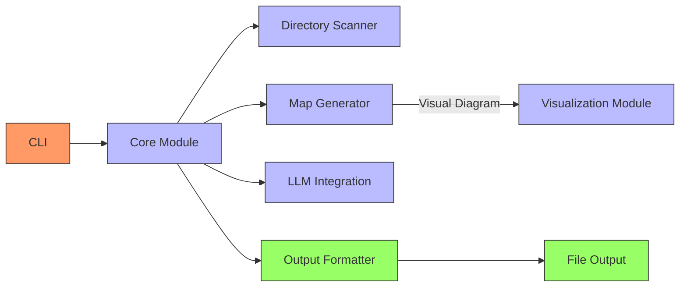

# llm-cartographer

A plugin for [Simon Willison's LLM tool](https://github.com/simonw/llm) that automatically maps and describes a codebase or project structure in a way which is token-efficient and ready to be consumed by an LLM.

## Installation

```bash
pip install llm-cartographer
```

Or directly from the repository:

```bash
pip install git+https://github.com/yourusername/llm-cartographer.git
```

## Features

- 🔍 **Comprehensive Analysis**: Scans directory structure, important files, and language statistics
- 📊 **Token Efficiency**: Creates compact representations optimized for LLM consumption
- 🧩 **Component Identification**: Identifies key components and their relationships
- 🧭 **LLM-Optimized Navigation**: Specialized format for efficient codebase navigation by LLM agents
- 📈 **Visual Diagrams**: Generate architecture diagrams in Graphviz, Mermaid, or PlantUML formats
- 🎯 **Multiple Analysis Modes**: Different approaches for varying needs (overview, components, architecture, flows)
- 💡 **Insights**: Provides architectural patterns and code organization understanding
- 📝 **Caching**: Avoids unnecessary re-processing of previously analyzed code

## Usage

Basic usage:

```bash
llm cartographer /path/to/your/project
```

This analyzes the project directory and generates a comprehensive description of the codebase structure.

### Common Examples

```bash
# Analyze current directory with default settings
llm cartographer .

# Save results to a file
llm cartographer /path/to/project -o analysis.md

# Analyze only Python files
llm cartographer . --filter-extension py

# Use a specific LLM model
llm cartographer . --model gpt-4o

# Focus on a component-specific analysis
llm cartographer . --mode components

# Generate a visual diagram
llm cartographer . --visual

# Generate an LLM-optimized navigation map
llm cartographer . --llm-nav
```

### Command Options

```
Options:
  -e, --exclude TEXT             Patterns to exclude (gitignore format)
  --max-files INTEGER            Maximum number of files to analyze (default: 100)
  --max-file-size INTEGER        Maximum file size in bytes (default: 102400)
  -o, --output PATH              Output file path or directory
  -m, --model TEXT               LLM model to use
  --follow-symlinks              Follow symbolic links
  --json                         Output as JSON
  -f, --filter-extension TEXT    Only include files with these extensions
  --cache-dir TEXT               Cache directory path
  --mode [overview|components|architecture|flows]
                                 Analysis mode (default: overview)
  --focus TEXT                   Focus analysis on a specific subdirectory
  --reasoning INTEGER RANGE      Reasoning depth (0-9, where 0=minimal and 9=maximum) (default: 5)
  --visual                       Generate visual diagram of codebase architecture
  --diagram-format [graphviz|mermaid|plantuml]
                                 Format for diagram generation (default: graphviz)
  --llm-nav                      Enable LLM-based codebase navigation
  --nav-format [markdown|json|compact]
                                 Format for navigation output (default: markdown)
  --include-source               Include source code snippets in navigation output
  --help                         Show this message and exit.
```

## Features in Detail

### Analysis Modes

- **overview**: General analysis of the entire codebase structure and functionality
- **components**: Focus on identifying and explaining the main components and modules
- **architecture**: Analysis of architectural patterns and system organization
- **flows**: Identification of key data and control flows through the system

### Visual Diagrams

The `--visual` flag generates architecture diagrams in your chosen format:



Supported diagram formats:
- **graphviz**: Standard DOT format diagrams
- **mermaid**: Markdown-compatible diagrams that render in GitHub, VS Code, etc.
- **plantuml**: Advanced UML diagrams

## LLM-Optimized Codebase Navigation

The LLM navigation feature (`--llm-nav`) creates specialized output formats designed specifically for LLM agents to efficiently navigate codebases.

### Benefits

Traditional codebase summaries are designed for human readers and can be inefficient for LLMs:
- They use too many tokens on descriptive text that doesn't help with navigation
- They lack explicit structural links between components
- They emphasize readability over functional navigation

### Navigation Features

The LLM-optimized navigation map provides:

- **Import/dependency graphs**: Shows which files import which, making relationships explicit
- **Function/method index**: Maps all functions to their locations with parameter information
- **Entry point identification**: Highlights key entry points to the codebase
- **Navigation paths**: Defines common paths through the codebase for common tasks
- **Compact representation**: Minimizes token usage while maximizing navigational value

### Navigation Output Formats

```bash
llm cartographer /path/to/codebase --llm-nav --nav-format markdown
```

Available formats:
- **markdown**: Structured format with sections for key files, functions, and relationships
- **json**: Complete structured data for programmatic usage and detailed analysis
- **compact**: Ultra-dense format optimized for minimal token usage

### Example Navigation Output

```
# MyProject Navigation Map

## KEY FILES
- `main.py` (Python) - Imports: 5, Imported by: 0
- `utils/helpers.py` (Python) - Imports: 2, Imported by: 8

## ENTRY POINTS
- `main.py` - Matches entry point pattern main\.py$
- `cli.py` - Imports 4 modules but isn't imported by others

## FUNCTION INDEX
- `main.py:run_app(config_path, debug)` - L15
- `utils/database.py:connect(uri, timeout, retry)` - L45

## CLASS INDEX
- `models/user.py:UserManager` extends BaseManager - 12 methods
- `api/endpoints.py:APIRouter` - 8 methods
```

### Direct Python Usage

```python
from llm_cartographer import CodebaseCartographer
from llm_cartographer.codebase_navigator import CodebaseNavigator
from pathlib import Path

# First collect data
cartographer = CodebaseCartographer(directory="/path/to/codebase")
collected_data = cartographer.scan_directory()

# Then create the navigator
navigator = CodebaseNavigator(
    directory=Path("/path/to/codebase"),
    collected_data=collected_data,
    include_source=True  # Optional
)

# Generate output
navigation_map = navigator.generate_llm_output(format="json")
```

### Standalone Navigator Script

```bash
python -m llm_cartographer.cli_navigator /path/to/codebase -o navigation_map.md
```

## How It Works

1. **Scanning**: The plugin scans the directory structure and collects information about files, directories, and languages.
2. **Mapping**: It creates a token-efficient representation of the codebase.
3. **Analysis**: The map is sent to an LLM for analysis of architecture, components, and workflows.
4. **Visualization**: If requested, a diagram of the codebase architecture is generated in the specified format.
5. **Output**: Results are formatted and returned, optionally saved to a file or directory.

## License

Apache License 2.0
