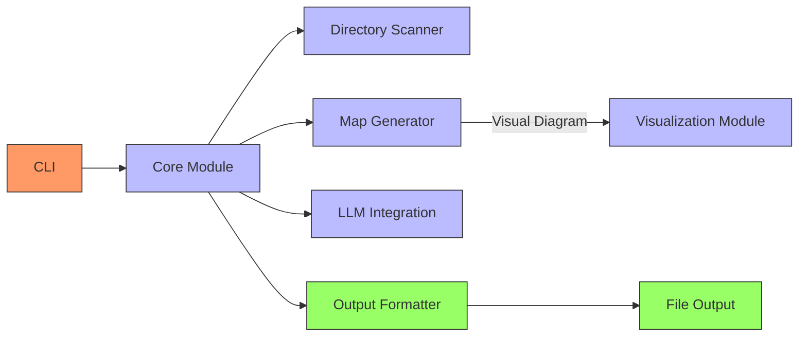

# Codebase Architecture Diagram

## Viewing Instructions

This diagram uses [Mermaid](https://mermaid-js.github.io/mermaid/), which is supported by:

- GitHub markdown (directly viewable in GitHub repositories)
- VS Code with the Markdown Preview Mermaid Support extension
- Most modern Markdown editors
- Online at [Mermaid Live Editor](https://mermaid.live/)
